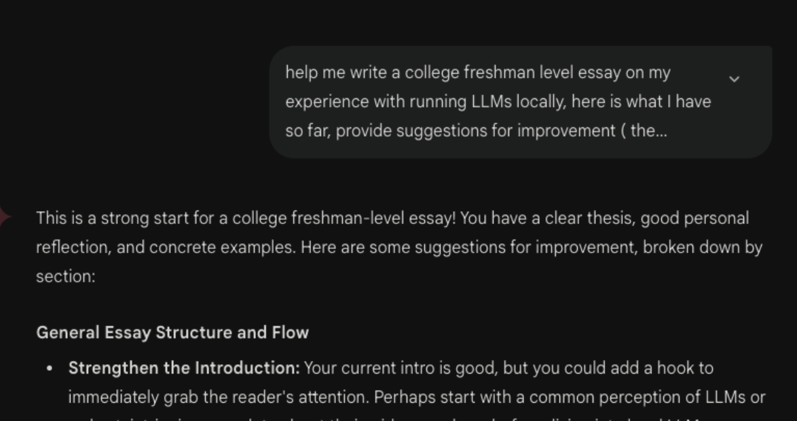
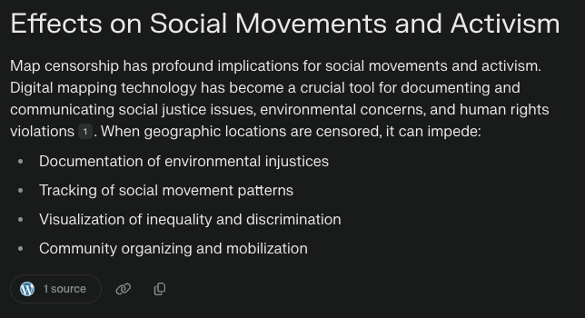

While most people have heard of LLMs, with some trying them out for themselves, few have tried running models on their own devices. With the power of “free” (meaning incredibly cheap compared to other services online) distant cloud computing in the AI sector has also come the disassociation between the capabilities of these models and the physical cost of running those models. For our LLM activity during my Algorithmic Culture class, due to my extensive testing of local LLMs for personal use, I chose to pick a model randomly and used Gemma 3:4B, an open weight model made by Google as a response to Meta’s Llama models. I found this selection interesting because I could directly compare its performance to the proprietary options Google provides via API: the Gemini LLM models. The activity of comparing local versus online LLM use helped me understand my own perceptions of AI and forced me to look into the real world impact of this virtual technology.

I have a lot of experience with running local AIs through writing neural networks in Python (both from scratch with NumPy and with ML frameworks like Pytorch), but those models have much more niche applications (handwriting recognition, labeling images) and are thus much smaller than the LLMs I was running, which were 4-6GB of RAM on average compared to half a gigabyte of RAM from running other individual programs on my computer. The moment I asked Gemma 3 questions about this essay (which by this point every college student has done at least once), my computer spiked to 115°C on the core (about 98℉ on the chassis of my Macbook Air) and I had to take it off my lap so I wouldn’t burn myself, and my computer was pulling almost 40W over a minute of answer generation (902 tokens at 18.51 tokens/s is about 48 seconds of generation time):

For that task, Gemma 3 generated a decent response comparing the progress of this essay to the rubric, noting the criteria I already filled, and importantly noting what I missed and what I can improve on; on my writing, it gave a 6/10. 
This is a vastly different experience from using the typical method of using an AI chat: API calls on the Internet. Doing the same task with Gemini 2.5 Flash and Gemini Diffusion (from https://deepmind.google.com/frontiers/gemini-diffusion)  led to the following:

> Gemini 2.5 Flash is Google’s current fast LLM, meant to be quick to call via API, cheap to call for automated services. 1375 tokens (calculated with https://tokenizer.streamlit.app/ )/ 11.46 seconds =  120 tokens per second, almost 10x the speed of my Macbook. It also gave me a 6/10.

> Gemini Diffusion is a very promising experiment from Google to make a very quick LLM, using principles from image diffusion models (like DALL-E) to autocorrect text very quickly and generate answers. With this method of generation, my response was received astronomically quickly:

> (Also I got a 4/10 according to Gemini Diffusion, so there is a lot to improve.)

What’s notable about using the web is from the user’s perspective, there is no drawback. My computer’s CPU stayed at a nominal 69℃, power usage was closer to 10W than 40W, and I got responses ten times faster. The power of cloud computing allows both general users and businesses to not worry about the technical side of using LLMs and just get their questions answered.

With the experiences of directly comparing local-based and cloud-based LLMs come a series of concerns. A trivial but interesting comment in the grand scheme of artificial intelligence concerns how the responsiveness of a model affects how it is treated. The astounding speed of the cloud-based models gave me the impression that the AI was effortlessly coming up with answers, that I could ask anything and it would find a solution; with the local model, I immediately began to subconsciously question the model, not trusting it nearly the same amount that I did the online AIs, even though Google themselves say Gemma 3 should be similar in capability to their proprietary Gemini Flash 2.0 model (Google). I also instinctively took more time to take in feedback from the slower model, having a conversation about my essay after I got the token speed measurement, while I just pelted the faster model with a barrage of questions, trying to just get a summary of answers so I could see what to add to this essay. Subconsciously, I treated the slower model in a more human way, a finding found to influence a large portion of people when interacting with AIs (Nass et. al); this can be an issue in the long run as humans don’t acknowledge the one trait LLMs share with humans: their ability to make mistakes. As AIs increase their responsiveness to user prompts as well as their image of omniscience, our view of AI could quickly turn from a guide, a partner in the creation and understanding of knowledge, to one of overreliance of a digital “Messiah.”
	  
Another more physical concern is the energy and water AI requires. Gemma 3 used about 2400 J, or 0.00067 kWh, and after using the model for half an hour, took another 20 minutes to t cool down to a temperature safe for my computer (because Macbook Airs rely on passive cooling) after ejecting the model and returning to normal. If each query takes roughly the same amount of energy expended (answering a query faster takes more computing power and energy), going by Google’s statistics of 35 million daily active users (Woo), 5 messages a day (one quarter of my use to be conservative), and  0.0003 kWh per query (efficiency is often found in bulk procession and caching, so we can say that server farms are twice as energy efficient), and you get 52,500 kWh per day as a lower bound; the amount of energy 5 American households use in a year. This calculation doesn’t account for API calls (which can be run at thousands of calls per minute and are the vast majority of AI calls), the actual energy inefficiencies that can occur running a large server farm for LLMs, energy fluctuations from longer queries and answers (I’ve had Gemini generate code almost 3x as long as the test query with Gemma), and all the other companies hosting their own AI models. Some estimates predict global AI energy consumption  becoming a 10th of the US’s 4000 TWh  per year, and global AI water consumption surpassing Denmark’s by 2027 (Li et. al), and that number will only go up as AI is more in demand.
	    
AI is here to stay, but understanding it remains a privilege. Proprietary systems and technical barriers keep most people in the dark about how these tools work and what they cost. My experience running LLMs locally has opened my eyes to these issues, but not everyone will have that chance to go to a school that criticizes technologies or have the resources to explore those ideas on their own. Moving forward, we must push for greater transparency of these technologies, which require our data to function so that everyone can participate in shaping our AI-powered future.

## References

* Li, Pengfei, et al. "Making AI Less 'Thirsty': Uncovering and Addressing the Secret Water Footprint of AI Models." arXiv:2304.03271, arXiv, 26 Mar. 2025. arXiv.org, https://doi.org/10.48550/arXiv.2304.03271.
* Nass, Clifford, et al. "Computers Are Social Actors." Proceedings of the SIGCHI Conference on Human Factors in Computing Systems, ACM, 1994, pp. 72-78. DOI.org (Crossref), https://doi.org/10.1145/191666.191703.
* "Water Consumption Statistics." Irrigreen, https://irrigreen.com/pages/water-consumption-statistics. Accessed 25 May 2025.
* Woo, Erin. "Google's Gemini User Numbers Revealed in Court." The Information, 23 Apr. 2025, https://www.theinformation.com/briefings/googles-gemini-user-numbers-revealed-court.
* "Introducing Gemma 3: The Most Capable Model You Can Run on a Single GPU or TPU." Google, 12 Mar. 2025, https://blog.google/technology/developers/gemma-3/.

